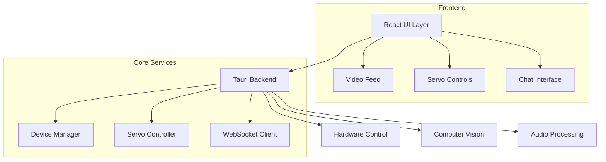

# Desky: 您的智能桌面伙伴

## 项目背景

Desky 是一个融合了人工智能对话、计算机视觉和硬件控制的智能桌面机器人。这个项目的灵感来源于人机交互的发展和个人助理机器人的潜力。我们的目标是创建一个能够进行自然语言对话，同时具备视觉感知和物理响应能力的桌面伙伴。

无论是在工作中需要快速查询信息，还是在学习时需要及时的解答，或者只是想找个伙伴聊聊天，Desky 都能成为您得力的助手。它不仅能听懂您的话，还能用温暖的声音回应您，甚至能通过摄像头"看"到您，用微小的头部动作与您互动。

## Desky 能做什么？

1. **智能对话**：利用先进的AI模型，Desky 可以理解并回应各种话题的对话。
2. **语音交互**：Desky 不仅能听，还能说，让您的交流更自然。
3. **视觉感知**：通过内置摄像头，Desky 能识别您的位置，保持"目光交流"。
4. **情感表达**：通过头部动作，Desky 能表达简单的情感和反应。
5. **个性化助手**：从日程提醒到信息查询，Desky 都能任。

## 部分截图
主要交互界面


设备状态


设置界面-api设置，就是用来生成表情的


设置界面-设备设置


设置界面-tts


## 原理

Desky 主要包含以下几个核心组件：

1. **AI 对话系统**：利用 OpenAI 的 GPT 模型进行自然语言处理和生成。这使得机器人能够理解用户输入并生成相应的回复。

2. **语音合成**：使用 OpenAI 的文本转语音（TTS）API 将机器人的文本回复转换为语音输出，提供更自然的交互体验。

3. **计算机视觉**：通过摄像头和 OpenCV 库实现实时人脸检测。这使得机器人能够"看到"用户，为进一步的交互奠定基础。

4. **舵机控制**：使用 Raspberry Pi 的 PWM 接口控制舵机，实现机器人头部的物理运动，使交互更加生动。

5. **Tauri 框架**：采用 Rust 和 Web 技术构建跨平台桌面应用，确保性能和易用性的平衡。

## 使用方法

### 准备工作

1. 确保您的系统已安装 Rust 和 Node.js。
2. 安装 Tauri CLI：`npm install -g @tauri-apps/cli`
3. 克隆本项目：`git clone https://github.com/iaiuse/desky.git`
4. 进入项目目录：`cd desky`

### 配置

1. 运行应用：`npm run tauri dev`
2. 在应用中，点击"Show Config"按钮。
3. 输入您的 OpenAI API 密钥。
4. 根据需要启用摄像头和舵机控制。
5. 点击"Save Configuration"保存设置。

### 使用

1. 在主界面的输入框中输入您想说的话。
2. 点击"Send"按钮或按回车键发送消息。
3. 等待机器人的回复，它会以文本和语音形式呈现。
4. 如果启用了摄像头，您可以在界面上看到摄像头捕捉的画面和人脸检测结果。
5. 如果启用了舵机控制，机器人的"头部"会根据检测到的人脸位置进行相应的转动。

## 注意事项

- 请确保您有足够的 OpenAI API 使用额度。
- 摄像头和舵机控制功能需要相应的硬件支持。
- 首次运行时，可能需要安装一些额外的赖，请按照提示进行操作。

## 贡献

我们欢迎任何形式的贡献，无论是新功能的建议、bug 报告还是代码贡献。请随时提交 Issue 或 Pull Request。


## 项目结构




## 交互流程

```mermaid
sequenceDiagram
    participant U as User
    participant UI as Frontend
    participant B as Backend
    participant H as Hardware
    participant S as Server

    U->>UI: Input Text/Voice
    UI->>B: Send Request
    B->>S: API Call
    S-->>B: Response
    B->>UI: Update UI
    B->>H: Control Servo

## 开发环境要求

- Node.js >= 18
- Rust >= 1.75
- pnpm >= 8.0
- 操作系统：
  - macOS 10.15+
  - Windows 10+

## 许可证

本项目采用 MIT 许可证。详情请见 [LICENSE](LICENSE) 文件。